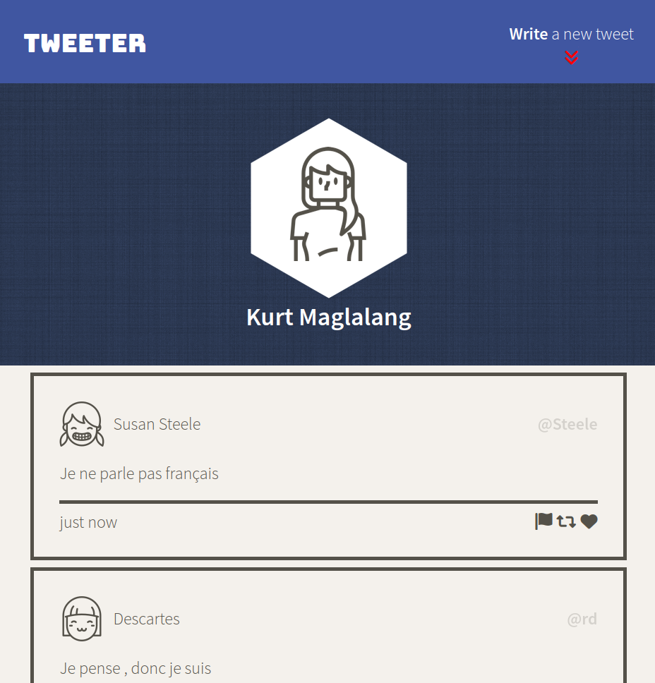
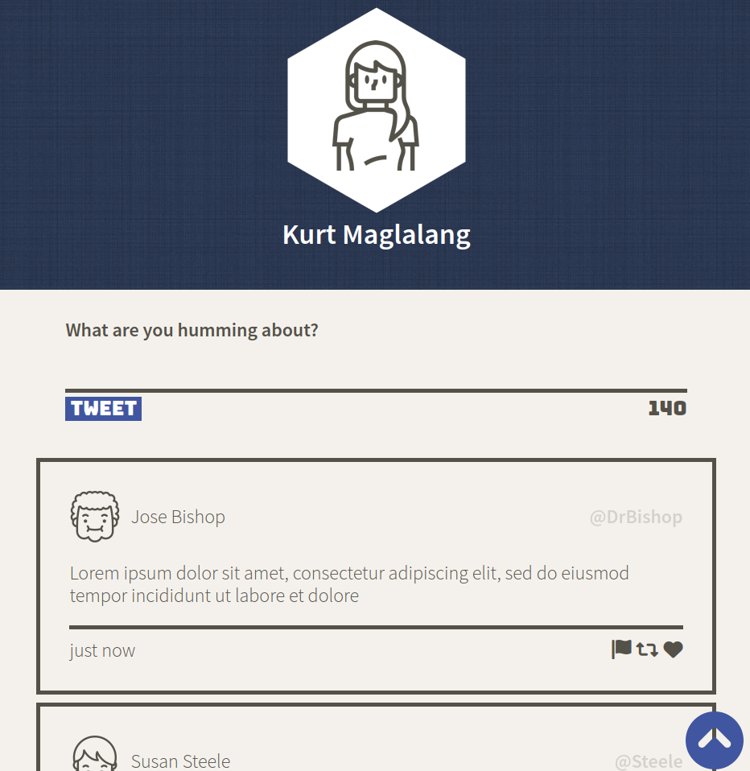
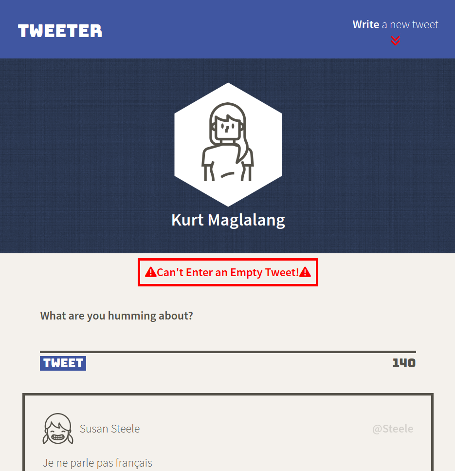
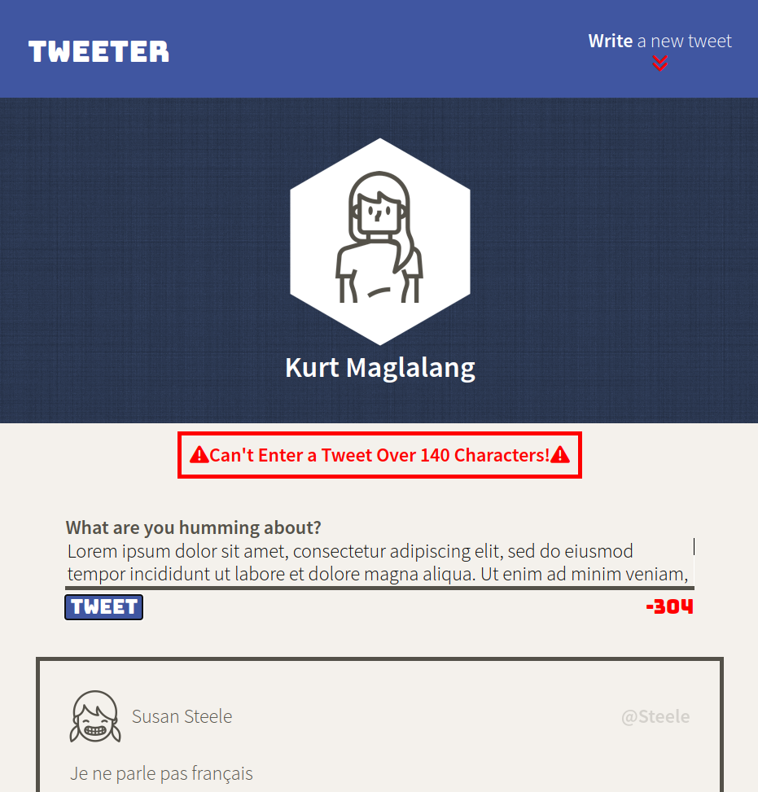
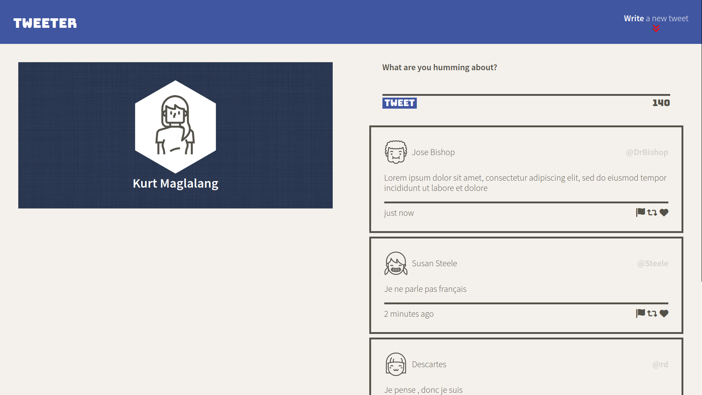

# Tweeter Project

Tweeter is a simple, single-page Twitter clone built using HTML, CSS, JS, jQuery and AJAX front-end. With Node and Express for the back-end.

## Screenshots
### Mobile View

### Desktop View

## Dependencies

- Express
- Node 5.10.x or above
- body-parser
- chance
- md5
## Development Dependencies
- nodemon
## Getting Started

1. Clone this repository onto your local device.
2. Install dependencies using the `npm install` command.
3. Start the web server using the `npm run local` command. The app will be served at <http://localhost:8080/>.
4. Go to <http://localhost:8080/> in your browser.
